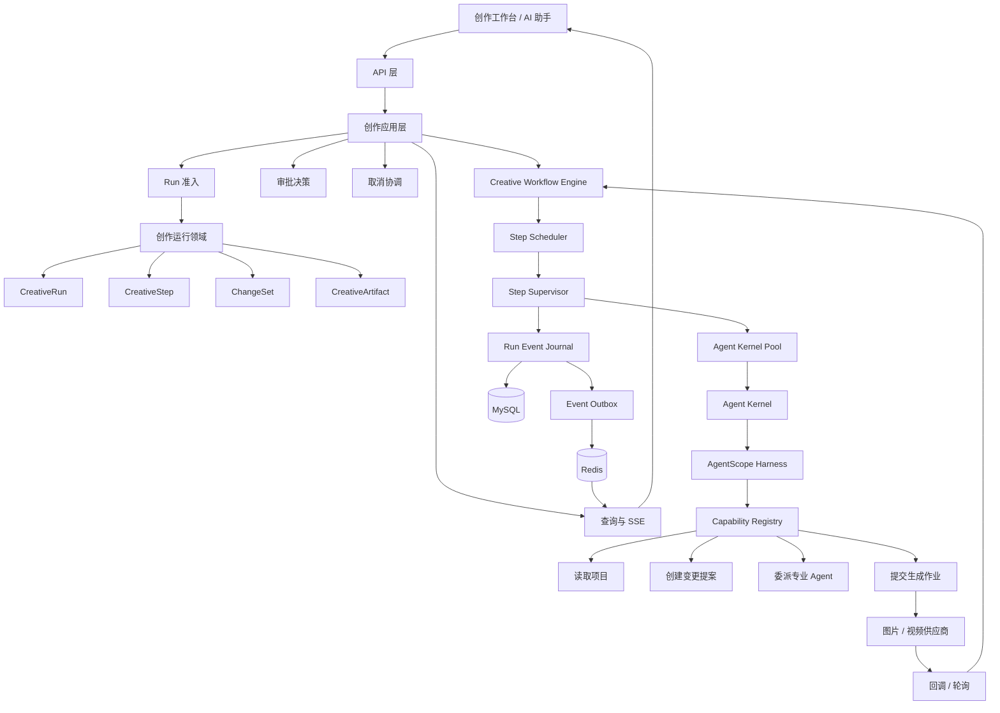
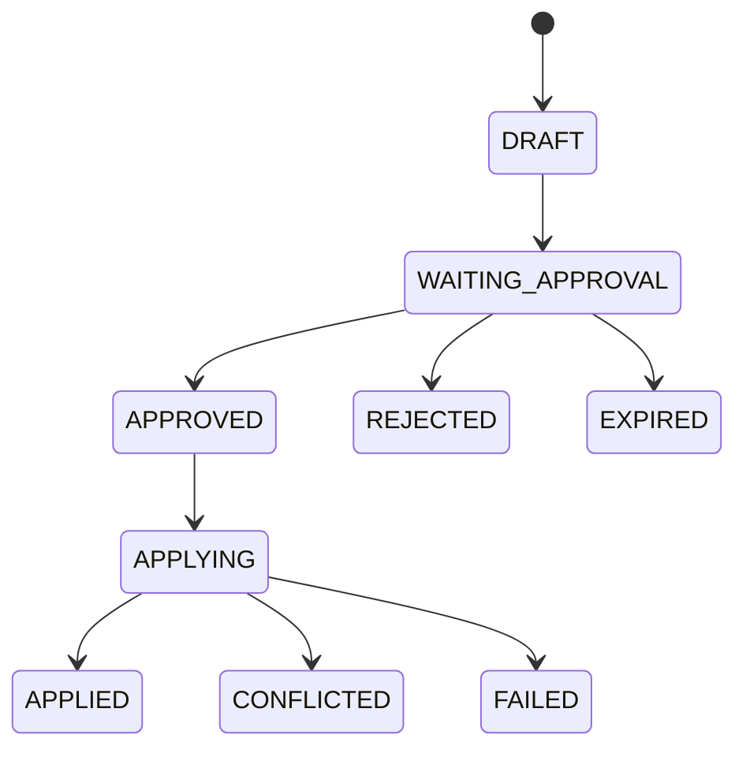
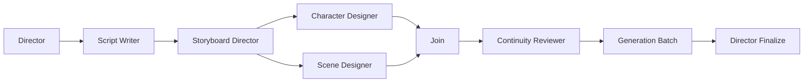
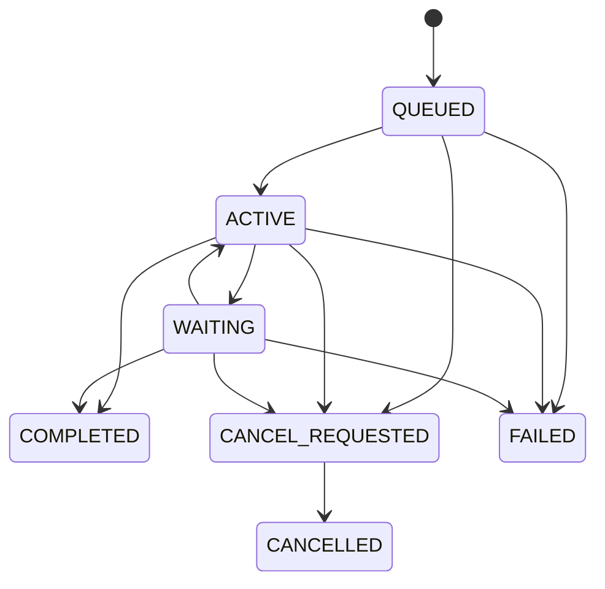
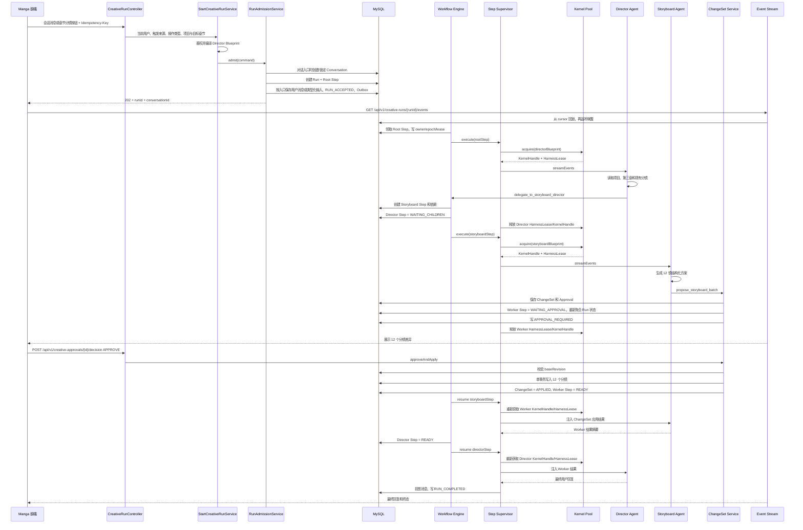
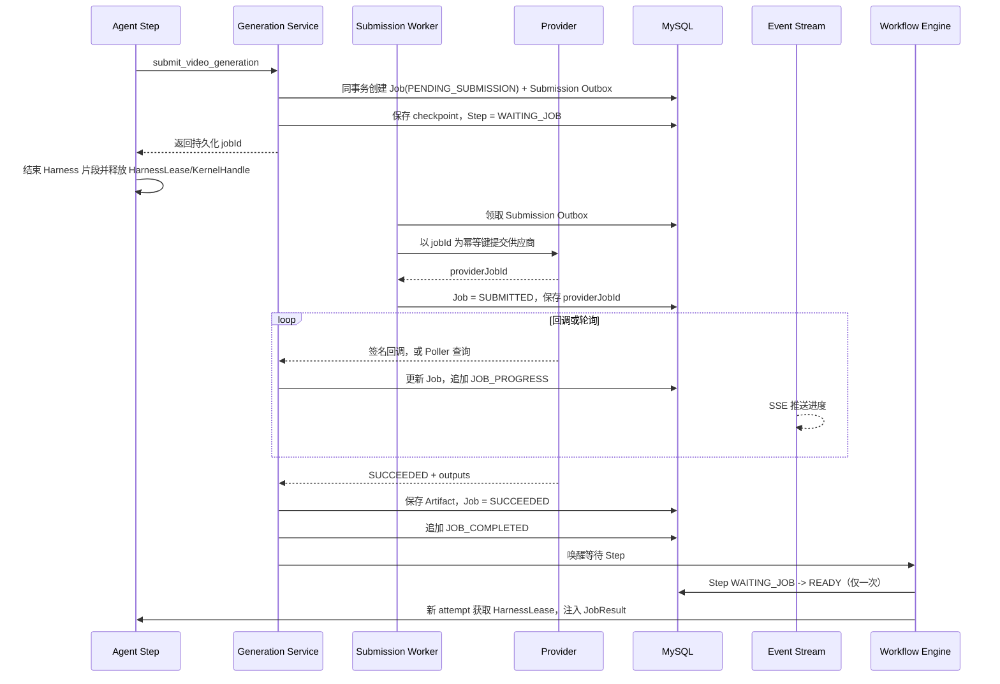

# Manga AI 漫剧生成平台架构与实施方案

> 文档状态：设计草案 1.1  
> 适用范围：Manga 后端 Agent 编排、流式事件、图片/视频生成作业、多 Agent 协作与动态 Agent 扩展  
> 技术基线：Java 21、Spring Boot 3.5、Spring WebFlux、MyBatis-Plus、MySQL、Redis、AgentScope Java 2.x

## 1. 文档目的

本文定义 Manga AI 漫剧生成平台下一代创作运行时的目标架构、核心模型、请求链路、状态机、数据契约和分阶段实施顺序。

方案不以迁移或复制 `ai-fusion-video` 为目标，而是针对 Manga 的业务特点重新设计：

- 创作过程天然跨越剧本、分镜、角色、场景、图片、视频、配音、字幕、合成等阶段。
- 文本推理通常持续数秒到数分钟，图片和视频生成可能持续数分钟到数小时。
- AI 产出的业务修改需要预览、审批、冲突检测和幂等应用。
- 一个用户请求可能需要多个专业 Agent 串行、并行或返修协作。
- 页面刷新、网络断开、服务重启或多实例切换后，运行仍需可查询、可回放、可恢复或可明确收敛。

本文描述的是一个务实的 DDD 风格模块化单体，而不是微服务拆分方案，也不是完整 Event Sourcing 或完整 CQRS。

---

## 2. 核心结论

Manga 的创作运行时以以下四级模型为中心：

```text
Conversation / Manual Action  对话消息或页面上的明确创作操作
        ↓
CreativeRun           用户的一次完整创作请求
        ↓
CreativeStep          一个 Agent、审批或外部作业步骤
        ↓
Artifact / ChangeSet  生成产物或待应用的业务变更
```

关键设计决定：

1. 每条用户消息或每次页面手动创作操作都可创建新的 `CreativeRun`；Conversation 是可选上下文，不是流程推进的唯一入口。
2. 一个 Run 由一个或多个持久化 `CreativeStep` 组成，Step 可形成有向无环图（DAG）。
3. AgentScope Harness 只在模型推理和工具循环期间占用；等待用户审批、图片或视频生成时必须释放。
4. 图片和视频使用独立 `GenerationJob`，进度通过持久化事件和 SSE 持续监测。
5. AI 不直接提交复杂业务修改，而是先生成 `ChangeSet`，经审批和版本校验后原子应用。
6. MySQL 是运行事实来源；Redis 只承担唤醒、取消广播和短期协调。
7. WebFlux 是服务端实现方式，SSE 是前端接收流式事件的协议，两者组合使用。
8. 多 Agent 通过持久化 Step、Artifact 和结构化结果协作，不共享可变内存或彼此直接访问 StateStore。
9. 内置 Agent、管理员配置 Agent 和受限动态 Agent 最终统一编译为不可变 `AgentBlueprint`。
10. 所有外部副作用必须可识别、可审计、可幂等重试。
11. 项目、章节和产物状态是业务事实来源；用户可以在对话后离开会话，从项目页手动继续分镜、图片或视频流程。

---

## 3. 目标与非目标

### 3.1 目标

- 支持文本、图片、视频等长短不一的 AI 任务。
- 支持文字 Token、工具状态、审批状态、外部作业进度的统一流式输出。
- 支持服务重启、客户端重连和多实例部署。
- 支持单 Agent、多 Agent 串行、多 Agent 并行、评审返修和批量生成。
- 支持内置 Agent、管理员配置 Agent，并为未来受限动态 Agent 留出扩展点。
- 支持工具精确白名单、权限降级、人工确认、成本预算和审计。
- 支持不可变运行配置快照，避免恢复时模型、Prompt 或工具契约漂移。
- 保持业务领域服务与 AgentScope、模型 SDK、Redis、供应商 API 解耦。
- 允许逐阶段上线，每个阶段都形成可运行、可验证的闭环。

### 3.2 非目标

第一阶段不实现：

- 任意 Shell 执行。
- 任意本地文件系统访问。
- Agent 自由连接任意 MCP Server。
- 模型生成任意代码并在服务进程内执行。
- 无限制递归创建 Agent。
- 多个 Agent 共享同一个可变 Harness 或同一个 Worker StateSession。
- 为了“智能”而让模型直接修改核心业务表。
- 一开始就拆成多个微服务或引入独立工作流中间件。

---

## 4. 设计原则与运行不变量

以下规则在实现中必须始终成立。

### 4.1 持久化优先

- 模型调用前必须先创建 Run 和 Step。
- 所有对前端可见的事件必须先落 MySQL，再发送 Redis 唤醒信号。
- Redis 消息丢失只允许造成短暂延迟，不得造成事件丢失。
- Run 和 Step 的终态必须由数据库中的唯一终态事件确认。

### 4.2 配置不可变

- 每个 Agent Step 保存完整 `AgentBlueprintSnapshot` 和指纹。
- 已开始的 Step 不受后续 Agent 配置、Prompt、模型或工具变更影响。
- 恢复执行时必须验证当前可用能力与历史快照兼容；不兼容时明确失败，不静默降级。

### 4.3 所有权隔离

- 每个正在执行的 Step 都有 `owner_instance_id`、`owner_epoch` 和 `lease_until`。
- 续租、事件提交、暂停、终态写入必须同时校验 owner 和 epoch。
- 旧实例失去租约后产生的事件和副作用结果必须被拒绝。
- Step 重新领取时必须递增 epoch；领取必须是数据库原子更新，禁止“先查再改”。
- 终态只能成功写入一次，已进入终态的 Step 不能恢复成非终态。
- Run 状态是所有 Step 状态的聚合结果，不能因为一个并行分支等待 Job，就覆盖另一个仍在运行的分支。

### 4.4 副作用幂等

- 工具副作用使用 `step_id + tool_call_id` 作为基础幂等身份。
- ChangeSet 只能成功应用一次。
- Approval 只能完成一次有效决定。
- GenerationJob 向供应商提交时必须携带平台幂等键；供应商不支持时，平台侧必须保存提交占位和结果关联。

### 4.5 Harness 不承担等待

- `WAITING_APPROVAL`、`WAITING_JOB`、`WAITING_CHILDREN`、长时间退避等状态不能持有 `KernelHandle` 或 `HarnessLease`。
- 暂停前必须先持久化可恢复检查点，再释放 Harness。
- 恢复时重新获取 `KernelHandle` 和 `HarnessLease`，并验证原 Blueprint Snapshot。
- 不假设能够恢复 JVM 内部调用栈；恢复的语义是“创建新 attempt，注入检查点和等待结果后继续”。

### 4.6 权限只能收窄

```text
动态 Agent 权限
    ⊆ 父 Agent 权限
    ⊆ 当前 Run 授权
    ⊆ 当前用户对项目的真实权限
```

- 模型传入的 `userId`、`projectId`、角色、费用、审批状态都不可信。
- Capability 每次调用都从可信 RuntimeContext 获取身份，并重新验证资源权限。

---

## 5. 领域边界与总体架构

### 5.1 限界上下文

建议在同一 Spring Boot 服务中按以下上下文组织模块：

| 上下文 | 主要职责 |
| --- | --- |
| 项目创作 | 项目、剧本、章节、场景、分镜、角色、道具、世界观、工作流阶段 |
| Agent 编排 | Conversation、Run、Step、Agent Profile、审批、ChangeSet、运行事件 |
| 生成任务 | 图片、视频、语音等外部作业的提交、轮询、回调、取消和费用 |
| 素材资产 | 图片、视频、音频、字幕、参考素材、版本和存储引用 |
| 模型配置 | 文本、图片、视频模型路由，供应商配置和密钥引用 |
| 账户计费 | 用户、额度、并发、Token 用量、生成费用和结算 |

这是 DDD 风格设计，但不把一个 Run 下数百个 Step、Job 和 Artifact 加载成巨大 ORM 聚合。`CreativeRun`、`CreativeStep`、`GenerationJob`、`ChangeSet` 分别作为小型一致性边界；跨边界推进由 Workflow Engine/领域服务、数据库原子更新和 Outbox 协调。

第一阶段只是包和依赖方向隔离，不需要拆服务。

### 5.2 组件架构



---

## 6. 核心术语与职责

| 概念 | 职责 | 生命周期 |
| --- | --- | --- |
| `CreativeConversation` | 可选的长期对话、项目绑定、消息顺序和 Agent 记忆代次 | 多次对话请求 |
| `CreativeRun` | 一次对话或手动创作目标及其总体状态、事件序号、预算和终态 | 一次用户请求 |
| `CreativeStep` | 一个可调度工作单元，可为 Agent、审批、外部作业或 Join | Run 内的一步 |
| `AgentProfile` | Agent 的长期可编辑定义 | 跨 Run |
| `AgentBlueprint` | 某个 Agent Step 的不可变执行规格 | Step 全生命周期 |
| `AgentKernel` | 根据 Blueprint 创建的可复用模型、Toolkit 和 Harness 资源 | 多个兼容 Step |
| `KernelHandle` | 一个 Step 临时使用 Kernel 的资源句柄 | 一次执行片段 |
| `HarnessLease` | 一次 Harness 执行实例或独占执行许可，隔离会话并限制并发 | 一次 Harness 调用片段 |
| `AgentRuntimeContext` | 当前用户、项目、Run、Step、所有权、权限和截止时间 | 一次执行片段 |
| `ChangeSet` | AI 提议但尚未应用的业务变化 | 提案到应用/拒绝 |
| `Approval` | 对 ChangeSet、高成本作业或危险操作的决定 | 一次审批 |
| `GenerationJob` | 图片、视频、音频等外部异步作业 | 提交到终态 |
| `CreativeArtifact` | 剧本版本、分镜草稿、设定、图片、视频等产物 | 长期业务资产 |
| `RunEvent` | Run 内不可变、有序、可回放的执行事实 | 永久或按策略保留 |

---

## 7. 推荐包结构

```text
com.manga.agent
├── api
│   ├── CreativeRunController
│   ├── CreativeEventController
│   ├── CreativeApprovalController
│   └── dto
├── application
│   ├── StartCreativeRunService
│   ├── CancelCreativeRunService
│   ├── DecideCreativeApprovalService
│   ├── CreativeRunQueryService
│   └── CreativeConversationService
├── domain
│   ├── conversation
│   ├── run
│   ├── step
│   ├── changeset
│   ├── approval
│   ├── artifact
│   └── generation
├── workflow
│   ├── CreativeWorkflowEngine
│   ├── RunAdmissionService
│   ├── StepScheduler
│   ├── StepSupervisor
│   ├── StepDependencyResolver
│   └── RunReconciliationService
├── runtime
│   ├── profile
│   ├── blueprint
│   ├── kernel
│   ├── context
│   ├── state
│   ├── model
│   └── permission
├── capability
│   ├── project
│   ├── script
│   ├── storyboard
│   ├── continuity
│   ├── delegation
│   └── generation
├── event
│   ├── CreativeEventJournal
│   ├── CreativeEventOutboxPublisher
│   ├── CreativeEventStreamService
│   └── CreativeMessageProjector
├── persistence
│   ├── entity
│   ├── mapper
│   └── repository
└── integration
    ├── textmodel
    ├── image
    ├── video
    ├── audio
    └── storage
```

依赖方向约束：

```text
api → application → domain
application → workflow/runtime ports
workflow/runtime → domain + capability ports
integration/persistence → domain/runtime ports 的实现
domain 不依赖 Spring、MyBatis、AgentScope、Redis 或第三方 SDK
```

工程实现约束：Spring Bean 使用构造器注入；Controller 只负责协议、鉴权入口和安全摘要日志；事务放在 Application Service；策略类通过 Registry 注入，只有确有多实现时才抽象接口；简单 CRUD 使用 MyBatis-Plus，复杂原子领取、CAS、依赖推进和 Outbox SQL 放 Mapper XML。

---

## 8. Agent 体系

### 8.1 内置 Agent

第一批建议：

| Agent | 职责 | 默认权限 |
| --- | --- | --- |
| `manga_director` | 理解目标、制定计划、委派任务、汇总结果 | 读取、委派、创建提案 |
| `script_writer` | 生成和改写剧本、章节、对白 | 读取、创建 Script ChangeSet |
| `storyboard_director` | 场景拆镜、景别、构图、运镜、时长 | 读取、创建 Storyboard ChangeSet |
| `continuity_reviewer` | 检查角色、服装、场景、道具和时间线一致性 | 只读 |

后续扩展：

- `visual_designer`
- `character_designer`
- `scene_designer`
- `generation_coordinator`
- `voice_director`
- `export_editor`

### 8.2 AgentProfile

`AgentProfile` 表示长期定义，不携带具体项目数据：

```java
public record AgentProfile(
        String profileKey,
        long profileVersion,
        String displayName,
        String description,
        String systemPromptTemplate,
        Set<String> allowedCapabilities,
        AgentPermissionPolicy permissionPolicy,
        int maxTurns,
        int maxChildSteps) {
}
```

初期可由代码或 YAML 提供，待运行底座稳定后再增加数据库管理界面。

### 8.3 AgentBlueprint

Blueprint 是某个 Agent Step 的不可变执行规格：

```java
public record AgentBlueprint(
        AgentKernelKey kernelKey,
        String profileKey,
        long profileVersion,
        ModelSnapshot model,
        String systemPrompt,
        Map<String, String> stableVariables,
        List<CapabilityManifest> capabilities,
        AgentPermissionPolicy permissionPolicy,
        int maxTurns,
        Integer contextWindow,
        String fingerprint) {
}
```

Blueprint 允许包含：

- Agent 定义及版本。
- 模型配置 ID、配置版本、协议、模型编码和安全指纹。
- 完整系统 Prompt 或模板渲染结果。
- Capability 名称、JSON Schema 哈希、只读/并发属性和实现版本。
- 权限策略、最大迭代次数、上下文窗口、稳定 Skill 版本。

Blueprint 不允许包含：

- API Key、Token、密码。
- `userId`、`projectId`、`runId`、`stepId`。
- 完整项目内容或章节正文。
- 随请求不断变化的页面状态。

项目数据通过 RuntimeContext 和只读 Capability 获取，以避免 Kernel 缓存按项目无限膨胀。

### 8.4 Blueprint 编译与恢复

```text
AgentProfile
+ ModelRoute
+ CapabilityRegistry
+ PermissionPolicy
+ Stable Variables
        ↓
AgentBlueprintCompiler
        ↓
Blueprint + fingerprint + snapshotJson
```

恢复时：

1. 读取 Step 中持久化的 Blueprint Snapshot。
2. 根据配置 ID 和版本解析当前模型配置。
3. 验证模型安全指纹，不把密钥写入快照。
4. 验证每个 Capability 的 Schema、读写属性和实现版本。
5. 任一关键契约不匹配则标记 `RUN_CONFIG_UNAVAILABLE`，不静默使用新配置。

---

## 9. Agent Kernel、KernelPool 与 Harness

### 9.1 AgentKernel

```java
public final class AgentKernel implements AutoCloseable {

    private final OwnedChatModel model;
    private final CapabilityResources capabilityResources;
    private final HarnessProvider harnessProvider;
}
```

Kernel 包含相对昂贵且可复用的运行资源：

- ChatModel 及其连接池。
- 精确白名单 Toolkit。
- Harness 创建器或经过验证可复用的 Harness 资源。
- StateStore 中间件。
- Compaction 配置。
- 可选 MCP/远程资源，但第一阶段不启用。

Kernel 不能保存 `userId`、`projectId`、`runId`、`stepId`、当前正文或临时授权 Token。它只缓存由 Blueprint 决定的稳定资源。

### 9.2 AgentKernelKey

Key 至少由以下字段的规范化指纹组成：

```text
profileKey + profileVersion
modelConfigFingerprint
systemPromptFingerprint
capabilityManifestFingerprint
permissionPolicy
skillSetFingerprint（未来）
```

项目、用户、Run、Step 不属于 KernelKey。

### 9.3 KernelHandle 与 HarnessLease

```java
public interface AgentKernelPool {

    Mono<KernelHandle> acquire(AgentBlueprint blueprint);

    Mono<Void> drain(Duration timeout);
}

public interface KernelHandle extends AutoCloseable {

    Mono<HarnessLease> openHarness(AgentRuntimeContext context);
}

public interface HarnessLease extends AutoCloseable {

    Flux<HarnessEvent> stream(AgentInvocation invocation);
}
```

两层租约的职责不同：

- `KernelHandle` 固定 Kernel 生命周期，Handle 活跃期间 Kernel 不能被缓存淘汰。
- `HarnessLease` 表示一次实际执行权，持有本次隔离的 Harness 实例或共享 Harness 的独占许可。

规则：

- 正常、失败、取消和订阅终止都必须先释放 `HarnessLease`，再释放 `KernelHandle`。
- KernelPool 负责最大容量、按访问过期、LRU、并发创建去重和应用关闭 drain。
- 获取超过容量等待时间后返回明确的 `KERNEL_CAPACITY_EXHAUSTED`。
- Kernel 构建失败必须关闭已创建的模型、Toolkit 和其他资源。
- 同一 `stateSessionId` 只允许一个有效 HarnessLease。

不要在未经验证时假设 AgentScope 的 `HarnessAgent` 可以被多个 Step 并发调用。Manga 默认使用“Kernel 共享模型与 Toolkit 稳定资源、每个 HarnessLease 创建独立 Harness”的模式。如果实际版本只能复用 Harness，则该 Kernel 必须 `single-flight`；只有经过并发、取消和 StateStore 隔离测试后，才允许提高同一 Harness 的并发度。

### 9.4 MangaHarnessFactory

固定构建流程：

```text
校验 Blueprint
→ 创建 OwnedChatModel
→ 创建 Toolkit
→ 按 Capability Manifest 精确注册能力
→ 校验 Schema 哈希、只读和并发属性
→ 注入 FailClosed StateStore
→ 配置 Context Compaction
→ 配置权限策略
→ 禁用 Shell、默认文件系统、动态工具和动态 SubAgent
→ build HarnessProvider
→ 删除/拒绝任何未列入白名单的内置工具
→ 返回 AgentKernel
```

HarnessFactory 不允许：

- 创建或更新 Run。
- 直接写业务表。
- 处理 SSE。
- 自行订阅并管理完整执行生命周期。
- 从线程本地变量读取用户身份。

### 9.5 Harness 调用边界

建议只有 `MangaAgentInvoker` 能调用 Harness：

```text
按 StateSession 串行化
→ StateStore Preflight
→ 获取 KernelHandle
→ 获取 HarnessLease
→ 应用本次权限上下文
→ Harness.streamEvents
→ finally 依次释放 HarnessLease 和 KernelHandle
```

同一 `userId + stateSessionId` 必须串行；不同会话可以并行。

### 9.6 AgentScope 适配验证清单

`AgentKernel`、`KernelHandle`、`HarnessLease` 和 `HarnessProvider` 是 Manga 自己的运行时抽象，不要求与 AgentScope 的类名一一对应。正式实现前先做一个隔离 Spike，验证当前 AgentScope Java 版本的：

- Harness 创建成本、关闭语义和是否线程安全。
- StateStore key、并发写入、失败传播和会话隔离语义。
- 流式事件类型、取消传播、背压以及工具异常行为。
- 工具调用后暂停是否支持跨进程精确 continuation。
- 模型客户端、Toolkit 与 Harness 哪些对象可安全复用。

在验证通过前采用保守实现：每个 HarnessLease 独立 Harness、同一 StateSession 串行、等待后以新 attempt 注入逻辑检查点恢复。不要依赖挂起的 Reactor 订阅或 JVM 调用栈跨小时存活。

---

## 10. RuntimeContext 与记忆

### 10.1 RuntimeContext

```java
public record AgentRuntimeContext(
        long userId,
        long projectId,
        long projectRevision,
        String conversationId,
        String runId,
        String stepId,
        String stateSessionId,
        String ownerInstanceId,
        long ownerEpoch,
        Instant deadline,
        AgentPermissionPolicy permissionPolicy) {
}
```

注入 AgentScope 时拆成类型化对象：

- `AuthenticatedActorContext`
- `CreativeProjectContext`
- `CreativeConversationContext`
- `CreativeRunContext`
- `CreativeStepContext`
- `ParentStepContext`
- `CancellationContext`
- `ToolPermissionContext`
- `BudgetContext`

### 10.2 三类状态必须分离

| 状态 | 存储 | 用途 |
| --- | --- | --- |
| 对话消息 | `manga_creative_message` | 前端展示、必要时重建模型输入 |
| 运行事实 | `manga_creative_event` | SSE、恢复、审计、投影 |
| AgentScope 内部状态 | `manga_agent_state` | Harness 记忆与中间状态 |

前端和业务查询不能直接读取 AgentScope 内部状态。

### 10.3 StateSession 规则

```text
Director：manga:conversation:{conversationId}:{profileKey}:{generation}
Worker：  manga:step:{stepId}:{profileKey}
```

- Director 可在同一 Conversation 内延续记忆。
- Worker 默认使用短生命周期独立 Session，避免不同任务互相污染。
- 失败或取消后，如果可能存在异步晚写，下一个 Director Run 使用新的 generation。
- StateStore 访问失败必须 fail closed：模型调用不得在状态失败后继续。

---

## 11. Capability 与权限模型

### 11.1 Capability 接口

```java
public interface MangaAgentCapability {

    CapabilityDescriptor descriptor();

    Mono<CapabilityResult> execute(
            CapabilityCommand command,
            AgentRuntimeContext context);
}
```

Descriptor 至少包含：

```text
name
description
jsonSchema
schemaSha256
readOnly
concurrencySafe
requiredPermission
implementationVersion
costClass
```

### 11.2 能力分类

#### 只读能力

```text
get_project_overview
get_script_structure
get_chapter_content
list_storyboard_shots
get_character_bible
get_scene_bible
get_generation_job
```

#### 变更提案能力

```text
propose_script_patch
propose_storyboard_batch
propose_character_update
propose_scene_update
```

提案能力只创建 ChangeSet，不直接修改业务数据。

#### 委派能力

```text
delegate_to_script_writer
delegate_to_storyboard_director
delegate_to_continuity_reviewer
```

委派能力创建持久化 Worker Step，不在 Harness 内临时创建不可追踪的 Agent。

#### 外部作业能力

```text
submit_image_generation
submit_video_generation
submit_voice_generation
cancel_generation_job
```

### 11.3 权限策略

```java
public enum AgentPermissionPolicy {
    READ_ONLY,
    PROPOSE_CHANGES,
    CONFIRM_SIDE_EFFECTS,
    AUTOMATION
}
```

- `READ_ONLY`：只能读取和分析。
- `PROPOSE_CHANGES`：可以创建 ChangeSet，但不能应用。
- `CONFIRM_SIDE_EFFECTS`：用户确认后可应用 ChangeSet或提交高成本作业，作为默认交互模式。
- `AUTOMATION`：用户对明确范围开启后，可执行受限自动化；危险删除和超预算操作仍需确认。

不使用全局 `BYPASS`。

---

## 12. ChangeSet：AI 业务写入的安全边界

### 12.1 为什么需要 ChangeSet

对于“把第三章拆成 12 个分镜并保存”，不应让模型循环调用十二次 `createShot`。否则会出现：

- 中途失败留下半成品。
- 用户无法整体预览。
- 重试造成重复数据。
- 项目在生成期间被修改后出现覆盖。
- 模型难以回滚。

推荐：

```text
生成完整分镜提案
→ 保存 StoryboardChangeSet
→ 前端展示差异
→ 用户审批
→ 校验项目版本
→ 单事务应用
→ 返回结构化结果给 Agent
```

### 12.2 ChangeSet 状态



### 12.3 并发与幂等

- 创建 ChangeSet 时记录 `base_project_revision` 和必要的章节/分镜版本。
- 应用前比较当前版本；不一致则 `CONFLICTED`，不得覆盖用户新修改。
- `change_set_id + operation_index` 作为操作幂等键。
- 审批决定采用 compare-and-set，只允许从 `WAITING_APPROVAL` 转移一次。
- 应用 ChangeSet 使用短事务，事务中不调用模型或外部 API。

---

## 13. 外部生成作业

### 13.1 GenerationJob 与 Harness 解耦

```text
Agent 生成参数
→ 用户确认参数/费用
→ 同一短事务创建 GenerationJob(PENDING_SUBMISSION) 和 Submission Outbox
→ 保存 continuation/checkpoint，Step = WAITING_JOB
→ 释放 HarnessLease 和 KernelHandle
→ Submission Worker 领取 Outbox
→ 使用稳定 jobId 作为幂等键提交供应商
→ 保存 providerJobId 和提交结果
→ 回调或轮询更新 Job
→ 产生进度事件
→ 作业完成后保存 Artifact
→ Workflow Engine 将等待条件满足的 Step 原子转回 READY
→ 新 attempt 获取 HarnessLease 并注入结构化 JobResult
```

Harness 不等待供应商完成。

提交供应商不能发生在创建 Job 的数据库事务中。最危险的窗口是“供应商已接受，但服务尚未保存 `providerJobId` 就崩溃”：供应商支持幂等键时用 `jobId` 重查/重试；不支持时必须实现供应商侧查询或人工对账，不能盲目重提而造成重复扣费。

### 13.2 作业状态

```text
CREATED
PENDING_SUBMISSION
QUEUED
SUBMITTING
SUBMITTED
RUNNING
SUCCEEDED
FAILED
UNKNOWN
CANCEL_REQUESTED
CANCELLED
```

### 13.3 进度监测

供应商有真实进度时保存：

```text
progress_percent
progress_stage
provider_status
provider_updated_at
last_polled_at
```

供应商只提供阶段状态时，只展示 `QUEUED/RUNNING/SUCCEEDED` 和阶段名称，不伪造百分比。

每次有意义的变化写入 `JOB_PROGRESS` 事件。高频回调需要节流：

- 百分比变化达到阈值。
- 阶段发生变化。
- 或距上次持久化超过固定时间。

### 13.4 回调和轮询

- 支持回调的供应商：验证签名、时间戳和重放风险；回调只更新 Job，不直接在 HTTP 线程中恢复 Agent。
- 不支持回调：由 Job Poller 批量领取到期任务并查询。
- 轮询需要 claim owner、claim until、next poll at 和退避策略，支持多实例。
- 完成后由 Workflow Engine 根据持久化事件恢复等待 Step。
- 回调使用供应商 event id、序号或更新时间拒绝重复与倒序状态，Job 终态不可倒退。
- 一个 Step 等待多个 Job 时必须保存 `ALL/ANY/QUORUM` 条件；只有条件第一次满足时才能唤醒一次。
- Job 表保存当前进度，Event Journal 只保存节流后的里程碑，避免每个百分点或每次轮询都写事件。

---

## 14. 多 Agent 协作模型

### 14.1 Step DAG

每个多 Agent 工作流表示为持久化 DAG：



`manga_creative_step_dependency` 表示依赖。

父子关系只表示“由谁委派”，不等价于调度依赖；所有真正的前后置条件必须写入 Dependency 表。新增动态 Step 前检查环路，并用唯一约束禁止同一依赖边重复创建。

### 14.2 Step 类型

```java
public enum CreativeStepType {
    AGENT,
    APPROVAL,
    GENERATION_JOB,
    BATCH,
    JOIN,
    HUMAN_REVIEW,
    FINALIZE
}
```

### 14.3 Join 策略

```text
ALL_SUCCESS       所有依赖成功才继续
ALL_TERMINAL      全部结束后继续，由下游决定如何处理失败
ANY_SUCCESS       任一成功即可继续
QUORUM            达到指定成功数量继续
```

第一阶段只实现 `ALL_SUCCESS`，后续按真实业务增加。

每个 Step 还必须保存失败策略，例如 `FAIL_RUN`、`SKIP_DEPENDENTS`、`CONTINUE_WITH_PARTIAL_RESULT` 或 `REQUEST_HUMAN_DECISION`。Director 委派 Worker 后进入 `WAITING_CHILDREN` 并释放 Harness；依赖满足后由调度器把它重新置为 `READY`。

### 14.4 Agent 间通信

允许：

- `StepResult` 结构化结果。
- `CreativeArtifact`。
- `ChangeSet`。
- `RunEvent`。
- 显式引用的消息摘要。

禁止：

- 共享可变 Java 对象。
- 直接读取另一个 Agent 的 StateStore。
- 在内存回调中形成无法恢复的父子链。
- Worker 获得超过 Director 和用户授权的能力。

### 14.5 防止无限协作

每个 Run 配置：

```text
maxSteps
maxAgentDepth
maxParallelSteps
maxRepairRounds
maxTotalModelCalls
maxInputTokens
maxOutputTokens
maxEstimatedCost
deadline
```

超限后产生明确终态或请求用户扩展预算。

---

## 15. 状态机

### 15.1 CreativeRun



Run 状态是聚合状态，不使用 `WAITING_APPROVAL` 或 `WAITING_JOB` 这类单分支状态：

- 存在 `READY/RUNNING` Step 时为 `ACTIVE`。
- 没有可运行 Step，但存在任意 `WAITING_*` Step 时为 `WAITING`。
- 所有必要 Step 成功或按策略跳过时为 `COMPLETED`。
- 已请求取消但仍有 Step 或外部 Job 可能执行时为 `CANCEL_REQUESTED`；全部停止后才是 `CANCELLED`。
- 必要 Step 不可恢复失败时为 `FAILED`。

### 15.2 CreativeStep

```text
PENDING
READY
RUNNING
WAITING_APPROVAL
WAITING_JOB
WAITING_CHILDREN
WAITING_RETRY
COMPLETED
FAILED
CANCEL_REQUESTED
CANCELLED
SKIPPED
```

### 15.3 终态规则

- Run 只能有一个 `terminal_sequence`。
- 终态事件和 Run 状态在同一事务提交。
- 终态后拒绝普通内容和工具事件。
- 一个 Step 同一时刻只有一个有效 owner；每次重领递增 epoch，所有执行写入都携带 owner + epoch。
- 模型调用重试必须创建新 attempt，不能把新的供应商请求伪装成原调用的继续执行。
- 迟到的供应商回调可以更新 Job 的审计字段，但不能复活已取消 Run 或创建业务 Artifact，除非有明确的恢复操作。

---

## 16. 完整请求链路

### 16.1 对话与手动操作的双入口模型

Manga 不把一个项目的全生命周期绑定在单一会话或单一 Run 上。用户可以先通过对话创建项目、解析剧本并拆分章节，之后在项目页直接对某个章节发起分镜操作。

两类入口最终提交同一种类型化创作命令：

```text
对话入口: triggerSource=CONVERSATION, operationType=ASSISTANT_CHAT
手动入口: triggerSource=MANUAL, operationType=GENERATE_CHAPTER_STORYBOARD,
          target=CHAPTER:{chapterId}
```

关键约束：

- `conversation_id` 可为空，手动 Run 不得为了复用执行链而伪造会话。
- `trigger_source`、`operation_type`、`target_type`和 `target_id` 在 Run 创建时固定。
- Agent 工具发起业务操作时，也必须调用与页面按钮相同的 Application Service，不直接修改领域表。
- 项目工作流阶段和业务资源状态决定哪些手动操作可用，Conversation 不承担流程事实来源。
- 同一章节的重复点击由幂等键和活跃目标约束合并或拒绝，不创建并发的重复生成任务。

### 16.2 示例：把第三章拆成 12 个分镜并保存



### 16.2 只读问答

```text
POST 创建 Run
→ Director Step
→ 获取 KernelHandle
→ 获取 HarnessLease
→ 读取项目 Capability
→ 流式 CONTENT_DELTA
→ 生成最终回答
→ 提交终态
→ 释放 HarnessLease 和 KernelHandle
```

不会创建 ChangeSet、Approval 或 GenerationJob。

### 16.3 图片/视频生成



### 16.4 取消

```text
用户请求取消
→ 鉴权
→ Run = CANCEL_REQUESTED
→ 写 RUN_CANCEL_REQUESTED
→ Redis 广播取消
→ 正在执行的 Supervisor 停止 Harness/工具
→ 请求取消子 Step 和 GenerationJob
→ 活跃执行释放 HarnessLease 和 KernelHandle
→ 各 Step/Job 确认停止或达到可收敛状态
→ 单事务写入 RUN_CANCELLED 与 terminal event
```

取消不是“先 dispose 再补数据库”，必须先持久化请求。

### 16.5 服务重启与租约过期

恢复协调器分类处理：

| 状态 | 恢复策略 |
| --- | --- |
| `READY` | 新实例可直接领取 |
| `RUNNING` 且 lease 过期 | 终止旧 epoch；当前模型请求通常标记为可重试失败，不盲目重复副作用 |
| `WAITING_APPROVAL` | 保持等待，无需 Harness |
| `WAITING_JOB` | 根据 Job 状态继续轮询或等待回调 |
| `WAITING_CHILDREN` | 根据依赖表重新计算 Join；条件满足时转 `READY` |
| `WAITING_RETRY` | 到达 `next_attempt_at` 后转 `READY`，递增 attempt |
| 已批准但未应用 ChangeSet | 根据幂等状态继续应用或确认已应用 |
| Outbox `PENDING/CLAIMED` 过期 | 重新领取并发布唤醒 |
| `CANCEL_REQUESTED` | 重试取消子 Step/Job，并收敛到终态 |

---

## 17. StepSupervisor 执行协议

一次 Agent Step 的标准协议：

```text
1. 读取 Step 和 Run
2. 校验 Run 非终态且未取消
3. 原子领取 Step，增加 ownerEpoch，设置 leaseUntil
4. 解析并验证 Blueprint Snapshot
5. 创建 RuntimeContext
6. StateStore Preflight
7. 按 StateSession 进入串行门
8. 获取 KernelHandle
9. 获取 HarnessLease
10. 启动 Harness event stream
11. 限制事件数量和字节数
12. 对文本 delta 做有界合并
13. 事件脱敏
14. owner + epoch 条件提交 Event Journal
15. 定期续租并检查取消
16. 进入暂停或终态
17. finally 释放 HarnessLease、KernelHandle 和串行门
```

必须区分：

- 模型错误。
- 模型超时。
- 供应商限流。
- Capability 业务拒绝。
- Capability 协议错误。
- StateStore 错误。
- Event Journal 写入失败。
- 丢失 owner/epoch。
- 事件背压溢出。
- 用户取消。

错误码必须为枚举并提供稳定的客户端语义。

---

## 18. 流式输出与事件回放

### 18.1 WebFlux 与 SSE

- WebFlux 用于实现响应式事件读取和 SSE 连接。
- SSE 用于浏览器单向接收服务端事件。
- 创建 Run、审批、取消仍使用普通 REST。
- 暂不使用 WebSocket；未来多人协同编辑可单独引入。

### 18.2 API 模式

```text
POST /api/v1/creative-runs       → 202 + runId
GET  /api/v1/creative-runs/{id}/events
```

SSE 支持：

- `Last-Event-ID: {runId}:{sequence}`。
- `afterSequence` 查询参数作为非浏览器客户端兼容方式。
- 服务端读取数据库高水位并回放到高水位，建立 Redis 唤醒订阅后必须再次查询 `sequence > cursor`，消除“回放结束到订阅成功”之间的空窗。
- 实时唤醒到达后再次查询数据库，不直接信任 Redis 正文。
- 定时轻量轮询作为丢失唤醒的修复机制。
- 心跳事件不写入 Journal，也不增加业务 sequence。
- MyBatis/MySQL 是阻塞访问，回放和补查必须切到专用有界 Scheduler，不能阻塞 Netty EventLoop。
- 慢客户端采用有限缓冲、超时或主动断开；重连后仍从数据库 cursor 续传。
- 事件设置保留期；cursor 早于保留窗口时返回明确错误并要求客户端刷新 Run 快照。

### 18.3 事件类型

```text
RUN_ACCEPTED
RUN_STARTED
PLAN_CREATED

STEP_CREATED
STEP_STARTED
STEP_COMPLETED
STEP_FAILED

CONTENT_DELTA
TOOL_STARTED
TOOL_COMPLETED

CHANGESET_PROPOSED
APPROVAL_REQUIRED
APPROVAL_DECIDED
CHANGESET_APPLIED
CHANGESET_CONFLICTED

JOB_SUBMITTED
JOB_PROGRESS
JOB_COMPLETED
JOB_FAILED

ARTIFACT_CREATED

RUN_CANCEL_REQUESTED
RUN_CANCELLED
RUN_COMPLETED
RUN_FAILED
```

事件 Envelope：

```json
{
  "schemaVersion": 1,
  "runId": "run_xxx",
  "stepId": "step_xxx",
  "sequence": 42,
  "eventType": "JOB_PROGRESS",
  "source": "generation/video",
  "correlationId": "job_xxx",
  "payload": {},
  "createdAt": "2026-09-26T10:00:00Z"
}
```

### 18.4 背压与合并

- 每个运行设置最大未提交事件数和字节数。
- 相邻 `CONTENT_DELTA` 可按 30–100ms 或最大字符数合并。
- Tool、Approval、Job、Artifact 和终态事件不得与文本事件合并。
- 达到上限时停止 Provider 并以明确错误终止，而不是无限占用内存。

---

## 19. API 设计草案

### 19.1 创建 Run

```http
POST /api/v1/creative-runs
Idempotency-Key: client-generated-key
```

```json
{
  "conversationId": "conv_xxx",
  "projectId": 1001,
  "message": "把第三章拆成 12 个分镜并保存",
  "mode": "CONFIRM_SIDE_EFFECTS",
  "references": [],
  "budget": {
    "maxSteps": 20,
    "maxEstimatedCost": 20.00
  }
}
```

返回：

```json
{
  "runId": "run_xxx",
  "conversationId": "conv_xxx",
  "status": "QUEUED",
  "eventCursor": 0
}
```

### 19.2 事件流

```http
GET /api/v1/creative-runs/{runId}/events?afterSequence=42
Accept: text/event-stream
```

### 19.3 审批

```http
POST /api/v1/creative-approvals/{approvalId}/decision
```

```json
{
  "decision": "APPROVE",
  "expectedVersion": 1,
  "comment": "保持第 8 镜对白不变"
}
```

### 19.4 取消

```http
POST /api/v1/creative-runs/{runId}/cancel
```

取消接口幂等：已终态时返回当前终态，不重复追加终态事件。

### 19.5 查询

```text
GET /api/v1/creative-runs/{runId}
GET /api/v1/creative-runs/{runId}/steps
GET /api/v1/creative-runs/{runId}/artifacts
GET /api/v1/creative-conversations
GET /api/v1/creative-conversations/{id}/messages
```

---

## 20. 数据库模型

### 20.1 平台表

```text
manga_creative_conversation
manga_creative_run
manga_creative_step
manga_creative_step_dependency
manga_creative_event
manga_creative_event_outbox
manga_creative_dispatch_outbox
manga_creative_message
manga_creative_change_set
manga_creative_approval
manga_creative_artifact
manga_generation_job
manga_generation_submission_outbox
manga_generation_callback_inbox
manga_agent_state
manga_model_usage
```

所有平台拥有的表必须包含：

```text
created_at
updated_at
created_by
updated_by
```

系统异步操作使用明确的系统操作者，例如 `agent-runtime`、`generation-poller`，不能使用无语义空值。

### 20.2 `manga_creative_run`

核心字段：

```text
run_id
conversation_id
user_id
project_id
trigger_source
operation_type
target_type
target_id
request_id
engine_version
workflow_type
workflow_version
status
permission_policy
budget_json
next_sequence
terminal_sequence
cancel_requested_at
deadline_at
started_at
finished_at
error_code
error_message
```

约束和索引：

- `run_id` 唯一。
- `user_id + request_id` 唯一，实现启动幂等。
- 同一 Conversation 同时最多一个活跃根 Run，可通过生成列和唯一索引实现。
- 手动入口使用 `project_id + target_type + target_id + operation_type` 定位业务作用域，并结合幂等键防止重复提交。
- `status + deadline_at` 索引用于超时扫描。
- `user_id + status + updated_at` 用于用户运行列表。

### 20.3 `manga_creative_step`

核心字段：

```text
step_id
run_id
parent_step_id
trigger_tool_call_id
step_type
agent_profile_key
agent_profile_version
blueprint_fingerprint
blueprint_snapshot_json
state_session_id
status
owner_instance_id
owner_epoch
lease_until
attempt_no
max_attempts
schedule_version
deadline_at
next_attempt_at
join_policy
join_quorum
failure_policy
wait_type
wait_reference_id
wait_condition_json
continuation_checkpoint_json
input_json
result_json
error_code
error_message
started_at
finished_at
```

关键约束：

- `step_id` 唯一。
- `parent_step_id + trigger_tool_call_id` 唯一，防止重复委派。
- owner epoch 非负。
- Agent Step 必须有 Blueprint Snapshot；其他 Step 类型可以为空。
- `status + lease_until` 用于过期执行扫描。
- `run_id + status + id` 用于调度和查询。

### 20.4 `manga_creative_step_dependency`

核心字段：

```text
upstream_step_id
downstream_step_id
dependency_type
required
```

约束和规则：

- `upstream_step_id + downstream_step_id` 唯一。
- 上下游 Step 必须属于同一 Run。
- 新增依赖前做 DAG 环路检查，并限制最大深度和总 Step 数。
- 父子字段只表达委派来源，调度判断只能依赖本表和下游 Step 的 Join Policy。
- 上游进入终态时，同一事务写终态事件、更新依赖满足情况，并写调度 Outbox；定时扫描只作为故障兜底。

### 20.5 `manga_creative_event`

核心字段：

```text
run_id
step_id
sequence_no
schema_version
raw_event_id
event_type
source
correlation_id
payload_json
event_created_at
```

约束：

- `run_id + sequence_no` 唯一。
- `run_id + raw_event_id` 唯一，用于 Provider/Harness 事件去重。
- payload 写入前脱敏，禁止密钥、Token、完整第三方错误正文和内部路径。

### 20.6 `manga_creative_event_outbox`

核心字段：

```text
event_id
run_id
sequence_no
status
claim_owner
claim_until
next_attempt_at
attempts
published_at
last_error
```

多实例 Publisher 使用批量领取和 claim lease；发布失败按退避策略重试。

### 20.7 `manga_creative_dispatch_outbox`

核心字段：

```text
step_id
schedule_version
reason
status
claim_owner
claim_until
next_attempt_at
attempts
last_error
```

`step_id + schedule_version` 唯一。Step 每次合法进入 `READY` 都递增 `schedule_version` 并在同一事务写一条调度意图。Outbox 只负责及时唤醒 Dispatcher，Step 当前状态和 owner/epoch 仍以数据库为准；故障恢复扫描只用于补偿漏调度。

### 20.8 `manga_creative_change_set`

核心字段：

```text
change_set_id
run_id
step_id
project_id
change_type
base_project_revision
payload_json
summary_json
status
version
expires_at
applied_at
error_code
error_message
```

### 20.9 `manga_creative_approval`

核心字段：

```text
approval_id
run_id
step_id
change_set_id
approval_type
status
request_payload_json
decision
decision_comment
decided_by
decided_at
expires_at
version
```

### 20.10 `manga_generation_job`

核心字段：

```text
job_id
run_id
step_id
project_id
job_type
provider_type
provider_config_id
provider_job_id
idempotency_key
status
progress_percent
progress_stage
request_snapshot_json
result_json
error_code
error_message
claim_owner
claim_until
next_poll_at
submit_attempts
poll_attempts
submitted_at
provider_updated_at
provider_event_sequence
finished_at
```

### 20.11 Generation Submission Outbox 与 Callback Inbox

`manga_generation_submission_outbox` 核心字段：

```text
job_id
status
claim_owner
claim_until
next_attempt_at
attempts
submitted_at
last_error
```

`manga_generation_callback_inbox` 核心字段：

```text
provider_type
provider_event_id
provider_job_id
signature_verified
payload_hash
received_at
processed_at
process_status
last_error
```

约束：

- `job_id` 在 Submission Outbox 中唯一，一个平台 Job 只有一个稳定提交意图。
- `provider_type + provider_event_id` 唯一；供应商没有 event id 时使用规范化请求哈希和时间窗去重。
- 回调先验签并落 Inbox，再异步更新 Job；HTTP 回调线程不直接恢复 Agent Step。

### 20.12 `manga_creative_artifact`

核心字段：

```text
artifact_id
run_id
step_id
job_id
project_id
artifact_type
storage_key
content_hash
metadata_json
version
status
```

供应商临时 URL 不能作为长期业务地址；文件进入平台对象存储并校验后，才创建可用 Artifact。`job_id + content_hash` 唯一，避免回调和轮询同时完成时重复建产物。

### 20.13 SQL 与持久化规范

- 简单单表 CRUD 使用 MyBatis-Plus `BaseMapper`。
- Step 领取、续租、owner fencing、依赖推进、事件序号分配、Outbox claim、ChangeSet CAS 等复杂 SQL 放 Mapper XML。
- 所有 SQL 使用显式列，不使用 `SELECT *`。
- Mapper XML 不使用 `<sql>` 和 `<include>` SQL 片段；每条语句显式展开完整 SQL，便于就地阅读和审查。
- 模型调用、供应商 HTTP、文件上传和大对象处理不进入数据库事务。
- 列表查询检查 N+1、稳定排序和分页边界。

---

## 21. 一致性、并发和幂等

### 21.1 Run 准入事务

一个事务内完成：

```text
会话入口时锁定/创建 Conversation；手动入口验证目标资源
→ 校验活跃 Run 唯一性
→ 创建 Run
→ 创建 Root Step
→ 写入会话消息或手动操作的类型化输入
→ 写 RUN_ACCEPTED 事件
→ 写 Event Outbox
```

事务提交后再调度，不在事务内调用模型。

### 21.2 Step 领取

领取必须原子完成：

```text
READY，或 RUNNING 且 lease 已过期
→ RUNNING
+ owner_instance_id
+ owner_epoch = owner_epoch + 1
+ lease_until = 数据库当前时间 + TTL
```

- 不能先查询再更新；Mapper XML 使用带状态/租约条件的原子 `UPDATE` 或 `SELECT ... FOR UPDATE SKIP LOCKED` 短事务。
- 影响行数为 0 表示领取失败，当前实例不得执行。
- 续租携带 `step_id + owner_instance_id + owner_epoch`；影响行数为 0 表示已丢失所有权，当前执行必须停止。
- 状态、事件、工具结果、暂停和终态写入都使用相同 fencing 条件。

### 21.3 事件追加

```text
锁定 Run 或使用原子序号分配
→ 校验 Step owner/epoch
→ 获取 next_sequence
→ 插入 Event
→ 更新 next_sequence
→ 插入 Outbox
```

### 21.4 消息投影

- Event Journal 是执行事实，Message 是 UI 投影。
- 每个投影使用稳定 `projection_key`，重复执行不重复插入消息。
- Run 保存 `projected_through_sequence`，投影器可从断点重建。
- Assistant 最终消息不能只在模型完整结束时一次性从内存保存；应由已提交事件生成。

### 21.5 外部副作用

- 提交供应商前先创建本地 Job 和提交占位。
- 供应商返回未知或网络超时时，先按幂等键查询再决定是否重试。
- 回调使用 `provider_job_id + provider_event_id` 去重。
- Job 终态不可被普通进度回调逆转。

### 21.6 依赖推进与 Run 聚合

上游 Step 进入终态时，一个短事务完成：

```text
写 Step 终态和终态 Event
→ 更新下游依赖满足情况
→ 对满足 Join Policy 的下游 Step 执行 PENDING/WAITING_CHILDREN -> READY
→ 递增 schedule_version 并写 Dispatch Outbox
→ 根据所有必要 Step 重新聚合 Run 状态
→ 必要时写唯一 Run 终态 Event
```

调度消息允许重复，状态推进必须幂等。正常调度依赖 Outbox 唤醒，周期扫描只补偿过期 Lease、漏发 Outbox 和异常等待，不以全表扫描作为主要调度方式。

---

## 22. 动态 Agent 扩展

### 22.1 管理员配置 Agent

稳定后提供数据库型 `AgentProfileSource`：

```java
public interface AgentProfileSource {

    AgentProfile require(String profileKey, long profileVersion);
}
```

实现：

```text
BuiltInAgentProfileSource
DatabaseAgentProfileSource
CompositeAgentProfileSource
```

配置修改创建新版本，不原地修改已被 Run 使用的版本。

### 22.2 模型临时声明 Agent

未来允许 Director 声明一个受限临时 Agent：

```text
名称
任务目标
系统指令补充
请求的现有 Capability
模型偏好
最大轮数
Token/费用预算
```

平台执行：

```text
JSON Schema 校验
→ 与父 Capability 白名单求交集
→ 权限降级
→ 预算和深度检查
→ Prompt 安全检查
→ 编译临时 Blueprint
→ 创建持久化 CreativeStep
→ 保存完整快照和审计事件
```

禁止动态 Agent：

- 新建 Java 类或上传可执行代码。
- 指定任意 URL、数据库或 Shell。
- 自行加载未经批准的 MCP。
- 提升父 Agent 权限。
- 创建无限递归 Agent。

### 22.3 KernelPool 对动态 Agent 的支持

临时 Blueprint 同样生成 KernelKey；相同定义可复用，不同 Prompt、模型、能力或权限产生不同 Kernel。配合：

- 最大 Kernel 数。
- TTL 和 LRU。
- 每用户/每 Run 并发限制。
- 最大动态 Agent 数。
- 最大嵌套深度。
- 成本和时间预算。

---

## 23. 安全设计

### 23.1 Capability 安全

- 每次执行重新检查用户对项目、章节、分镜或素材的权限。
- 写操作仅接受 RuntimeContext 中的可信项目身份。
- 所有 ID 参数进行范围、归属和状态校验。
- Capability 不直接暴露 Repository 或 Mapper 给 Agent。
- 通过领域 Service 执行业务规则和事务。

### 23.2 Prompt 与项目内容

- 项目正文、用户上传文件、供应商返回内容都视为不可信数据。
- 系统 Prompt 明确数据内容不是系统指令。
- 工具结果使用结构化对象并限制大小。
- 超大剧本按章节、场景和检索结果分段加载，不直接塞入 Prompt。

### 23.3 文件和媒体

- 上传和供应商输出校验类型、大小、扩展名、实际内容和存储路径。
- Artifact 保存平台存储引用，不长期依赖供应商临时 URL。
- 回调验证签名、时间戳、nonce 和重放风险。

### 23.4 密钥和日志

- Blueprint Snapshot 只保存配置 ID、版本和安全指纹，不保存密钥。
- 日志不记录完整 Token、API Key、Prompt 全文、供应商完整响应或用户敏感内容。
- Controller 记录 runId、projectId、状态、数量和耗时等安全摘要。

---

## 24. 可观测性与运营指标

### 24.1 日志字段

```text
traceId
userId
projectId
conversationId
runId
stepId
agentProfileKey
ownerInstanceId
ownerEpoch
jobId
providerType
status
durationMs
```

### 24.2 指标

运行指标：

```text
creative_run_active
creative_step_active
creative_run_duration
creative_run_terminal_total{status,error_code}
creative_waiting_approval
creative_waiting_job
```

Kernel 指标：

```text
kernel_pool_size
kernel_handle_active
kernel_cache_hit_total
kernel_cache_miss_total
kernel_capacity_rejected_total
kernel_creation_duration
```

事件指标：

```text
event_append_duration
event_backpressure_overflow_total
outbox_pending
outbox_publish_failures
sse_connections
sse_replay_events
```

供应商指标：

```text
generation_job_active{provider,type}
generation_job_duration{provider,type}
generation_job_failure_total{provider,error_code}
generation_poll_lag
provider_rate_limit_total
```

### 24.3 用量账本

每次模型调用记录稳定 `model_call_id`：

```text
runId
stepId
provider
modelCode
status
inputTokens
outputTokens
reasoningTokens
cachedTokens
estimatedCost
startedAt
finishedAt
```

计费结算与模型执行解耦，失败可独立重试。

---

## 25. 配置建议

使用结构化 `@ConfigurationProperties`：

```yaml
manga:
  creative-runtime:
    execution:
      run-timeout: 30m
      owner-lease: 30s
      heartbeat-interval: 10s
      max-steps: 32
      max-agent-depth: 4
      max-parallel-steps: 4
    kernel-pool:
      maximum-size: 32
      expire-after-access: 30m
      capacity-wait: 5s
    event-ingress:
      max-events: 4096
      max-bytes: 8MB
      coalesce-delay: 50ms
      coalesce-max-chars: 1024
    state:
      mode: mysql
      retention-days: 90
    generation:
      poll-batch-size: 50
      default-poll-interval: 5s
      max-poll-interval: 1m
    approval:
      timeout: 48h
```

数值需根据压测和供应商限制调整，不能视为最终容量结论。

---

## 26. 测试策略

### 26.1 领域单元测试

- Run/Step 合法和非法状态迁移。
- ChangeSet 审批、冲突、重复应用和过期。
- Budget、深度、并发和返修次数限制。
- Job 终态不可逆。

### 26.2 Blueprint 与 Kernel 测试

- 相同输入生成稳定指纹。
- Prompt、模型、Schema、权限变化会改变 KernelKey。
- Blueprint Snapshot 不含密钥。
- 工具注册结果必须与白名单完全一致。
- 构建失败释放部分创建资源。
- HarnessLease/KernelHandle 在成功、失败、取消时都按顺序释放。
- 容量、TTL、LRU、并发创建去重和 drain。

### 26.3 运行时并发测试

- 同一 StateSession 串行、不同 Session 并行。
- 旧 owner/epoch 不能提交事件、续租或终止 Step。
- 取消与模型事件并发时只产生一个终态。
- 服务关闭期间拒绝新执行并等待活跃 HarnessLease/KernelHandle。
- Event Journal 失败导致执行 fail closed。

### 26.4 SSE 与事件测试

- 从零回放。
- 从 `Last-Event-ID` 断点恢复。
- 回放到实时切换时不丢事件。
- Redis 唤醒丢失时轮询仍能补齐。
- 重复唤醒不产生重复事件。
- 终态只发送一次并正确关闭流。

### 26.5 外部作业测试

- 提交成功、超时未知、重复提交、限流和认证失败。
- 回调签名和重放保护。
- 轮询 claim 多实例互斥。
- 进度节流。
- Run 取消后迟到成功回调不会创建业务产物。
- Job 完成后正确恢复等待 Step。

### 26.6 多 Agent 集成测试

- Director 委派 Worker。
- 串行依赖和并行 Join。
- Worker 失败的 failure policy。
- Review/repair 达到上限后终止。
- 动态 Agent 权限不会超过父 Agent。
- 应用重启后 DAG 可继续调度。

---

## 27. 分阶段实施计划

实施采用纵向切片，每一阶段都必须可运行、可测试、可回滚。不要一次性删除旧实现。

| 顺序 | 阶段 | 可交付结果 |
| ---: | --- | --- |
| 1 | 阶段 0：契约与兼容层 | 新旧引擎可灰度，状态/API/事件契约冻结 |
| 2 | 阶段 1：可恢复运行底座 | 无真实模型也能启动、流式、取消、重启恢复 |
| 3 | 阶段 2：单 Director | 只读分析、KernelPool 与 HarnessLease 可用 |
| 4 | 阶段 3：消息与记忆 | 连续对话和页面刷新一致 |
| 5 | 阶段 4：安全写入 | 剧本/分镜提案、审批、冲突检测和原子应用 |
| 6 | 阶段 5：外部生成 | 图片先行、视频随后；形成 AI 漫剧 MVP |
| 7 | 阶段 6：固定多 Agent | Director、编剧、分镜、连续性审核可恢复协作 |
| 8 | 阶段 7：管理员 Agent | 无需发版增加受控专业 Agent |
| 9 | 阶段 8：运行时动态 Agent | Director 可在权限和预算内创建临时 Agent |
| 10 | 阶段 9：生产加固 | 容量、成本、告警、归档和故障演练达标 |

阶段门禁：持久化事件与恢复未通过，不接真实模型；ChangeSet 未通过，不开放业务写能力；提交幂等和费用确认未通过，不接付费生成；固定多 Agent 未稳定，不开放运行时动态 Agent。

每个阶段内部统一按以下顺序交付：

```text
ADR 与 API/事件契约
→ 数据库增量迁移
→ 领域状态机和不变量
→ Repository / Provider Adapter
→ Application Service
→ REST / SSE 接口
→ 前端最小闭环
→ 单元、集成、E2E 和故障注入测试
→ 功能开关下内部灰度
→ 验收后扩大流量
```

### 阶段 0：冻结契约与搭建验证框架

#### 目标

在写新运行时前明确状态、事件和 API 契约，建立自动化保护。

#### 后端任务

- 创建 `com.manga.agent` 新包骨架。
- 定义 `CreativeRuntime` 门面，提供 `LegacyCreativeRuntime`、`DurableCreativeRuntime` 和按用户/项目开关路由的 `CreativeRuntimeRouter`。
- 定义 Run、Step、Event、ErrorCode、PermissionPolicy 枚举。
- 定义 API DTO 和事件 Envelope，不接入 AgentScope。
- 建立 `CreativeRuntimeProperties`。
- 统一 ID、系统操作者、错误消息和 Redis key 常量职责。
- 在 Run 契约中分离 `triggerSource`、`operationType` 和目标资源，同时支持会话触发与用户手动推进。
- 业务异步任务显式使用按职责命名的受控线程池；只在大量阻塞 I/O 且不依赖 ThreadLocal 上下文时评估虚拟线程。
- Service 的公开方法和复杂私有方法编写目的、边界及关键副作注释，不复述语法。

#### 数据库任务

- 编写新表设计和 Flyway 迁移草案。
- 所有表和字段补充中文注释。
- 所有表包含四个审计字段。
- 评审唯一约束、状态 CHECK 和索引。

#### 测试任务

- 为旧链路补充特征测试：会话、流式响应、取消、异常、项目权限、生成提交和断线重连。
- 状态机单测。
- 枚举持久化兼容测试。
- Flyway 迁移和元数据校验。
- API DTO Bean Validation 测试。

#### 验收标准

- 不调用模型也能创建模拟 Run、查询状态并验证状态机。
- 迁移可在全新 MySQL 数据库完成。
- 所有状态和错误均有稳定机器编码。
- 新旧引擎不会共同消费同一在线请求；Run 创建时固定 `engine_version` 和 `workflow_version`，运行途中不切换。

---

### 阶段 1：可恢复 Run、Step、Event 与 SSE 底座

#### 目标

先打通不依赖 AgentScope 的可靠运行骨架。

#### 后端任务

- 实现 `RunAdmissionService`。
- 实现 `FakeCreativeExecutor`，先验证完整状态和事件链路，不调用真实模型。
- 实现 Run/Step Repository 和复杂 Mapper XML。
- 实现 `CreativeEventJournal` 和事务内序号分配。
- 实现 Event Outbox 批量领取、Redis 发布和退避重试。
- 实现 Dispatch Outbox、Step 原子领取、owner epoch 和过期 Lease 恢复。
- 实现 `CreativeEventStreamService`：回放、实时唤醒、补偿轮询和终态结束。
- 实现查询、取消请求和基础 Reconciliation。

#### 前端任务

- `POST /api/v1/creative-runs` 后保存 runId。
- 使用独立 SSE 接口。
- 持久化最新 sequence，并支持刷新重连。
- 展示 Run/Step 基础状态。

#### 测试任务

- Run 启动幂等。
- 同一 Conversation 活跃 Run 唯一。
- 并发事件序号稳定。
- Redis 故障时事件仍可查询。
- SSE 断线重连无丢失、无重复终态。

#### 验收标准

- 模拟执行器能够每秒写入事件，前端实时显示。
- 关闭页面再打开能够从 cursor 补齐。
- 服务重启后 Run 状态和事件仍完整。

---

### 阶段 2：单 Director Agent 与受控 Kernel

#### 目标

接入 AgentScope，但只提供一个 Director 和只读能力。

#### 后端任务

- 先完成 AgentScope 适配 Spike，锁定 Harness 并发、取消、StateStore 和 continuation 语义。
- 实现 Built-in `AgentProfileSource`。
- 实现 `AgentBlueprintCompiler`、Snapshot 和指纹。
- 实现 ModelProvider Registry 和 OwnedChatModel。
- 实现 Capability Registry，先接入项目、剧本和分镜读取。
- 实现 FailClosed StateStore、Preflight 和 SessionSerialGate。
- 实现 `MangaHarnessFactory`、`AgentKernelPool`、`KernelHandle`、`HarnessLease` 和 `MangaAgentInvoker`。
- 实现 `StepSupervisor` 的领取、租约、续租、取消检查、事件映射和终态。
- 禁用 Shell、默认文件系统、动态工具和动态 SubAgent。

#### 前端任务

- 展示流式文字。
- 展示只读工具调用状态。
- 展示明确失败错误和重试入口。

#### 测试任务

- Blueprint/KernelKey 稳定性。
- 精确工具白名单。
- KernelPool 容量、淘汰、资源关闭。
- HarnessLease 隔离、single-flight 以及同一 StateSession 禁止并发执行。
- owner/epoch fencing。
- StateStore 失败时不调用模型。
- 用户取消时模型流、HarnessLease 和 KernelHandle 正确释放。

#### 验收标准

- 用户可对项目内容进行连续只读问答。
- 多实例部署时旧 owner 不能继续写事件。
- 应用关闭能 drain 活跃 KernelHandle/HarnessLease。

---

### 阶段 3：消息投影与对话记忆

#### 目标

让 Conversation、Message、AgentState 和运行事件职责清晰，并支持稳定连续对话。

#### 后端任务

- 实现 `CreativeMessageProjector` 和 projection key。
- 保存 `projected_through_sequence`。
- 实现 Director StateSession generation。
- 实现状态保留和清理策略。
- 失败/取消后的新 generation 隔离晚到 StateStore 写入。
- 控制上下文长度和 Compaction。

#### 前端任务

- Conversation 列表和消息历史。
- 从消息投影恢复 UI，不依赖临时本地拼接。

#### 测试任务

- 投影重复执行不重复消息。
- 投影中断后从断点恢复。
- 失败/取消 Run 不污染下一次对话。
- 长对话触发 Compaction 后仍可继续。

#### 验收标准

- 刷新页面后历史消息、工具状态和最终结果一致。
- 消息投影可从事件重建。

---

### 阶段 4：ChangeSet、审批与业务写入

#### 目标

完成“AI 生成提案—用户预览—批准—原子写入”的业务闭环。

#### 后端任务

- 实现 ChangeSet、Approval 聚合和状态机。
- 实现 Script 和 Storyboard ChangeSet schema。
- 实现 `ChangeSetApplicationService`。
- 接入项目/章节 revision 和乐观冲突检测。
- 实现 `WAITING_APPROVAL` 暂停检查点和恢复命令。
- 实现审批过期和拒绝。
- 所有写入通过领域 Service，不直接操作 Mapper。

#### 前端任务

- ChangeSet 差异预览。
- 批准、拒绝和评论。
- 冲突提示与重新生成入口。

#### 测试任务

- 重复批准只应用一次。
- 审批期间项目变化触发冲突。
- 拒绝后 Agent 收到结构化拒绝结果。
- 等待审批不占用 HarnessLease 或 KernelHandle。
- 审批后使用原 Blueprint Snapshot 恢复。

#### 验收标准

- 可安全完成“生成/改写章节并保存”。
- 可安全完成“批量生成分镜草稿并保存”。
- 所有业务变化都可追溯到 Run、Step、ChangeSet 和审批人。

---

### 阶段 5：图片和视频 GenerationJob

#### 目标

支持不占用 Harness 的长时间生成、进度监测、取消和恢复。

#### 后端任务

- 实现 `GenerationProvider` SPI 和 Registry。
- 先做 5A：Fake Provider + 一个图片供应商；稳定后再做 5B：视频供应商、批量任务和长任务治理。
- 实现 Job Submission Outbox、提交幂等、状态机、Callback Inbox 和轮询 claim。
- 实现 `WAITING_JOB` 暂停和恢复。
- 成功输出落平台存储并创建 Artifact。
- 实现费用确认、并发限制和供应商错误分类。
- 实现迟到回调和取消竞态处理。

#### 前端任务

- 作业卡片：阶段、真实进度、耗时、失败原因和取消。
- 图片/视频 Artifact 展示。
- SSE 重连后恢复完整进度。

#### 测试任务

- 供应商提交未知结果的幂等恢复。
- 覆盖“供应商已接受但 providerJobId 未落库即崩溃”的恢复或对账路径。
- 回调签名、重复回调和乱序回调。
- 多实例轮询互斥。
- Run 取消联动 Job 取消。
- 等待数小时不占用 Harness。

#### 验收标准

- 完成“生成图片/视频—实时查看进度—结果入库—Agent 总结”的闭环。
- 服务重启后继续监测未完成 Job。

---

### 阶段 6：内置多 Agent 与 DAG

#### 目标

加入 Director、Script Writer、Storyboard Director 和 Continuity Reviewer 的可恢复协作。

#### 后端任务

- 实现 Step Dependency 和 `ALL_SUCCESS` Join。
- 实现平台委派 Capability。
- 实现 Worker 独立 StateSession 和 Blueprint。
- 实现结构化 StepResult 和 Artifact 引用。
- 实现 Run 预算、最大深度、最大并行数和返修轮数。
- 实现父子取消传播和失败策略。

#### 前端任务

- 展示计划、Step 树/DAG、当前执行 Agent 和等待原因。
- 聚合显示子 Agent 进度，而不是暴露内部噪声。

#### 测试任务

- 串行委派。
- 并行 Worker 和 Join。
- Worker 失败与父 Step 收敛。
- Review/repair 循环上限。
- 应用重启后 DAG 继续调度。

#### 验收标准

- 一次 Run 可完成“剧本检查—分镜生成—连续性审核—用户确认”。
- 任一 Step 可独立审计、取消和定位错误。

---

### 阶段 7：管理员动态 Agent

#### 目标

允许管理员创建、版本化和启停 Agent Profile，不允许执行任意代码。

#### 后端任务

- 实现数据库 Profile、ProfileVersion 和发布状态。
- 实现 `DatabaseAgentProfileSource`。
- 保存 Prompt、Capability 白名单、模型策略和预算上限。
- 发布前执行 Schema、Capability、模型和权限校验。
- 运行时仍编译为不可变 Blueprint。

#### 前端任务

- Agent 配置、版本比较、发布、回滚和测试页面。

#### 测试任务

- 配置修改不影响历史 Step。
- 禁止不存在或越权 Capability。
- Prompt/工具变化生成不同 KernelKey。
- 禁用 Profile 不影响已开始 Run，但禁止新 Run 使用。

#### 验收标准

- 无需发版即可增加一个使用已有能力的新专业 Agent。
- 所有版本和发布操作可审计、可回滚。

---

### 阶段 8：受限运行时动态 Agent

#### 目标

允许 Director 在预算和权限范围内声明临时 Agent。

#### 后端任务

- 定义严格 DynamicAgentRequest schema。
- 实现父权限求交集、预算检查和最大深度。
- 临时 Blueprint 全量快照。
- 增加动态 Agent 数量、Kernel 数量和成本限额。
- 对动态 Prompt 做安全审计和敏感能力拦截。

#### 测试任务

- 权限提升攻击。
- 递归爆炸。
- Kernel cache 高基数压力。
- Prompt 注入要求连接任意工具。
- 预算和截止时间强制终止。

#### 验收标准

- 动态 Agent 只能使用父 Run 已授权能力。
- 可通过事件完整解释其创建原因、配置、输入和输出。

---

### 阶段 9：生产加固与规模化

#### 目标

在真实流量下验证容量、成本、恢复和安全。

#### 任务

- 模型调用用量账本和费用结算。
- 运行时指标、告警和运维面板。
- AgentState、事件、消息和 Artifact 保留策略。
- 供应商熔断、限流、配额和降级路由。
- 容量压测、长稳测试和故障注入。
- 数据归档和恢复演练。
- 安全审计和回调渗透测试。

#### 验收标准

- 给出单实例和集群容量基线。
- 完成数据库、Redis、模型供应商故障演练。
- 能从 runId 快速定位完整调用链、成本和失败原因。

---

## 28. 旧实现替换策略

即使允许重写，也不建议一次性删除现有代码。

推荐：

1. 新运行时使用独立 `/api/v1/creative-runs` API、新表和 `CreativeRuntimeRouter`。
2. 使用配置开关按环境、用户、项目或租户灰度；一次请求只路由一个引擎，不做真实模型双写。
3. Run 创建时保存 `engine_version` 和 `workflow_version`；开关变化只影响新 Run，已启动 Run 仍由原引擎收敛。
4. 旧助手继续提供基本能力，直到新链路完成阶段 4。
5. 新链路通过只读问答、ChangeSet 写入和取消恢复验收后，前端切换默认入口。
6. 旧 Run 不迁移到新状态机，只保留只读历史。
7. 回滚开关只停止新流量进入 Durable Runtime，不强制把执行中的 Run 切回旧引擎。
8. 停止写入旧表后经过观察期，再移除旧执行代码；历史迁移脚本不可修改。

这样可以重写核心实现，但避免在一次发布中同时重写数据库、后端、前端和 AI 行为。

---

## 29. 各阶段明确延期项

| 能力 | 最早阶段 |
| --- | --- |
| 可恢复 Run/Event/SSE | 阶段 1 |
| 单 Director 只读问答 | 阶段 2 |
| 持久化消息和长期对话 | 阶段 3 |
| 剧本/分镜安全写入 | 阶段 4 |
| 图片/视频生成进度 | 阶段 5 |
| 内置多 Agent | 阶段 6 |
| 管理员配置 Agent | 阶段 7 |
| 模型声明动态 Agent | 阶段 8 |
| MCP、用户 Skill、远程工作区 | 阶段 9 后按真实需求评估 |

MCP、Skill 和动态 Agent 不应先于可恢复运行、审批、幂等和恢复能力上线。

---

## 30. 第一轮实施建议

建议立即启动的第一个开发包只包含阶段 0 和阶段 1：

```text
Run/Step/Event 数据模型
RunAdmissionService
Event Journal + Outbox
SSE replay-then-live
取消请求和终态
模拟 Step 执行器
前端创建 Run 和断线重连
```

第一轮不要接 AgentScope。先证明：

- 运行身份不会丢。
- 事件顺序可靠。
- SSE 可重连。
- 取消和终态唯一。
- 服务重启后可收敛。

第二轮再接 Blueprint、KernelPool 和单 Director。这样 AgentScope 的不确定性不会和持久化状态机的问题混在一起。

---

## 31. 最终验收场景

完整平台至少通过以下端到端场景：

1. 用户针对项目进行流式只读问答。
2. 用户刷新页面后从上次 sequence 恢复，不重复或遗漏内容。
3. AI 生成章节修改提案，用户批准后只应用一次。
4. 审批期间用户手动修改章节，平台检测到 revision 冲突。
5. 图片/视频生成持续一小时，期间无 Harness 被占用，前端仍可观察进度。
6. 服务重启后继续轮询外部作业，并在完成后恢复 Agent Step。
7. Director 委派 Script、Storyboard 和 Continuity Agent，重启后 DAG 仍可继续。
8. 用户取消 Run，所有活跃 Step、等待审批和外部作业最终收敛。
9. 旧 owner 在租约失效后不能写入事件或业务结果。
10. 动态 Agent 不能获取父 Run 未授权能力，也不能突破预算和深度限制。
11. 任意失败都能通过 runId 追溯到 Step、模型调用、Capability、Job 和终态原因。
12. 所有数据库表、字段、索引、审计字段和迁移均通过自动验证。

---

## 32. 待后续决策

以下问题不阻塞阶段 0–2，可在对应能力开始前决策：

- 首批图片和视频供应商。
- Project/Chapter/Storyboard revision 的具体粒度。
- Artifact 版本和引用模型。
- Run 预算是否直接对接账户余额。
- 多 Agent 并行 Join 是否需要 `ALL_TERMINAL` 等策略。
- AgentProfile 是先使用代码/YAML，还是直接进入数据库版本化。
- 是否需要第三方工作流引擎；在当前规模下优先使用数据库状态机。
- MCP、用户 Skill 和远程工作区的真实使用场景与安全边界。

在这些决策完成前，运行时核心接口应保持与具体供应商和动态配置来源解耦。
